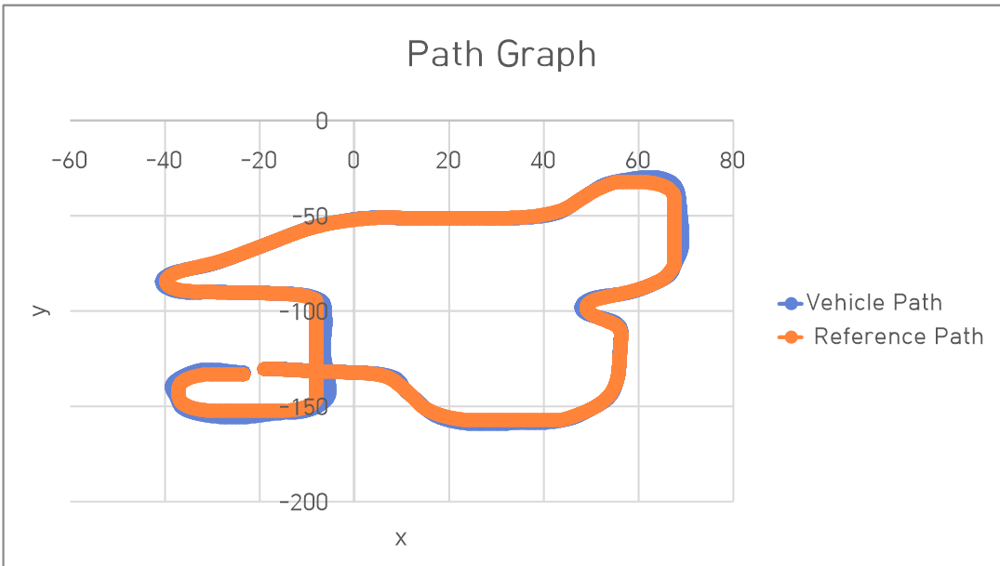

# CARLA Kanayama Trajectory Tracking Controller

## Project Overview

This project implements a trajectory tracking controller for an autonomous vehicle in the CARLA simulation environment using the Kanayama control algorithm.

The controller computes control inputs based on the position and heading errors between the vehicle and the reference trajectory.

## Controller Concept

The Kanayama controller is a nonlinear trajectory tracking method that uses the pose error between the vehicle and the reference trajectory.

The controller generates velocity and steering commands to reduce:

- position error
- heading error

This allows the vehicle to follow the desired trajectory.

## Simulation Environment

- CARLA Simulator
- Python implementation

## Result

Reference trajectory vs actual vehicle trajectory

The blue line represents the reference trajectory and the orange line represents the vehicle trajectory.

## Repository Structure

src/        Kanayama controller implementation  
data/       reference trajectory (CSV)  
result/     trajectory tracking result   

## Team:
- Jun Young Choi
- Hyeongju Yang
- Beomjun Kim
- Hyeonseung Yeo
- Noriya Hong
